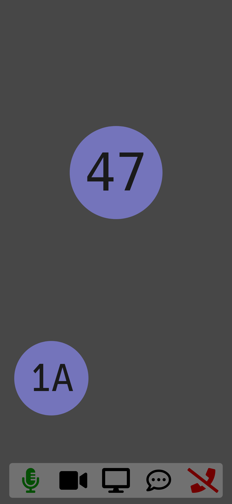

# basicWebRTC Module for SelfPrivacy

[basicWebRTC](https://github.com/cracker0dks/basicwebrtc) as [SelfPrivacy](https://selfprivacy.org/) module



[basicWebRTC](https://github.com/cracker0dks/basicwebrtc) is a simple audio/video calling app that runs in the browser.
It is encrypted and p2p over WebRTC.

### Limitations

Since it is p2p, there is a limit on how many participants can be in a call.
2-4 people should work fine in most cases,
but it depends on the bandwidth of the participants (because each participant connects to each other, network traffic grows exponentially the more people you add).
Such p2p call systems could be much more efficient if the broad internet would support IP multicast.

## Installation

Since this is a not an official module, you need to add it first
to the inputs of your SelfPrivacy instance.

Login to your server via ssh and open the inputs file:
```sh
nano /etc/nixos/sp-modules/flake.nix
```

Add this to the end of your file, but before `outputs = _: { };`:
```nix
  # Your own modules:
  inputs.basicwebrtc.url = "git+https://github.com/Simon-Laux/immich-selfprivacy-module";
```

Then run this command to make it appear in the SelfPrivacy app:
```sh
nix flake update --override-input selfprivacy-nixos-config git+https://git.selfprivacy.org/SelfPrivacy/selfprivacy-nixos-config.git?ref=flakes
```

Now you just need to activate the module in the SP app and navigate to the page to setup immich.

### Thanks

Thanks to cracker0dks for making basicWebRTC and thanks to SelfPrivacy and Nix Contributors for making nice software.
